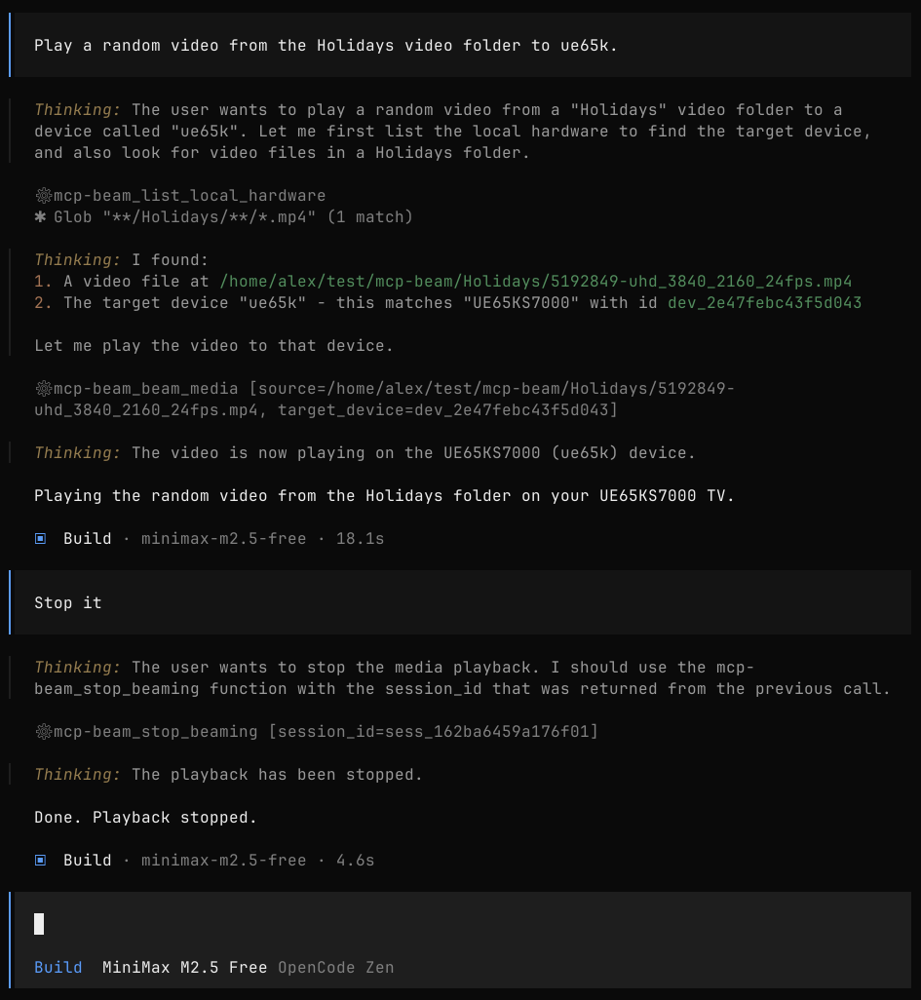

# mcp-beam


## Demo



`mcp-beam` is a MCP server (`stdio` transport) for casting local files and media URLs to Chromecast and DLNA/UPnP devices on your LAN.

It exposes three tools:
- `list_local_hardware`
- `beam_media`
- `stop_beaming`

## Highlights

- One server for both Chromecast and DLNA/UPnP workflows.
- Stable device IDs for reliable follow-up calls.
- Protocol-aware direct play and transcoding decisions.
- Safe-by-default path, URL, and bind policies.
- Structured errors with practical remediation hints.

## Table of Contents

- [Demo](#demo)
- [Quick Start](#quick-start)
- [Installation](#installation)
- [Runtime Dependencies](#runtime-dependencies)
  - [Go Installation](#go-installation)
- [Tool Reference](#tool-reference)
- [Transcode Behavior](#transcode-behavior)
- [Error Model](#error-model)
- [Environment Variables](#environment-variables)
- [Security](#security)
- [Architecture](#architecture)
- [Troubleshooting](#troubleshooting)
- [Development](#development)

## Quick Start

Get beaming in a few minutes.

### 1) Add `mcp-beam` to your MCP host config

CLI one-liners:

```bash
# Claude Code
claude mcp add --scope user mcp-beam -- go run go2tv.app/mcp-beam@latest

# Codex
codex mcp add mcp-beam -- go run go2tv.app/mcp-beam@latest

# Gemini
gemini mcp add mcp-beam go run go2tv.app/mcp-beam@latest
```

Generic JSON configuration (for MCP hosts using `mcpServers`):

```json
{
  "mcpServers": {
    "mcp-beam": {
      "command": "go",
      "args": [
        "run",
        "go2tv.app/mcp-beam@latest"
      ]
    }
  }
}
```

Notes:
- Requires `go` in `PATH` (Go `1.25+`).
- The first run may be slower due to module download/build.

### 2) Verify the server binary/module wiring

```bash
go run go2tv.app/mcp-beam@latest --version
go run go2tv.app/mcp-beam@latest --self-test
```

### 3) Run the tool flow

1. Call `list_local_hardware` and pick a device `id`.
2. Call `beam_media` with `source` and `target_device`.
3. Call `stop_beaming` when done.

Minimal example flow:

```json
{
  "name": "list_local_hardware",
  "arguments": {
    "timeout_ms": 3000,
    "include_unreachable": false
  }
}
```

```json
{
  "name": "beam_media",
  "arguments": {
    "source": "/absolute/path/to/video.mp4",
    "target_device": "dev_1234abcd",
    "transcode": "auto"
  }
}
```

```json
{
  "name": "stop_beaming",
  "arguments": {
    "session_id": "sess_abcd1234"
  }
}
```

## Installation

### Published module (recommended)

```bash
go run go2tv.app/mcp-beam@latest --version
go run go2tv.app/mcp-beam@latest --self-test
```

### Local checkout

From repo root:

```bash
go run . --version
go run . --self-test
```

Use this MCP config to run directly from source:

macOS/Linux:

```json
{
  "mcpServers": {
    "mcp-beam": {
      "command": "/bin/bash",
      "args": [
        "-lc",
        "cd /absolute/path/to/mcp-beam && go run ."
      ]
    }
  }
}
```

Windows PowerShell:

```json
{
  "mcpServers": {
    "mcp-beam": {
      "command": "powershell",
      "args": [
        "-NoProfile",
        "-Command",
        "Set-Location 'C:\\absolute\\path\\to\\mcp-beam'; go run ."
      ]
    }
  }
}
```

### Downloaded binary

Build locally:

```bash
go build -o ./bin/mcp-beam .
./bin/mcp-beam --version
./bin/mcp-beam --self-test
```

Or install from releases:
- `https://github.com/alex/mcp-beam/releases`

Linux/macOS checksum verify:

```bash
shasum -a 256 -c SHA256SUMS
```

Windows checksum verify:

```powershell
Get-FileHash .\mcp-beam_<version>_windows_amd64.zip -Algorithm SHA256
```

Linux/macOS unpack:

```bash
tar -xzf mcp-beam_<version>_<os>_<arch>.tar.gz
./mcp-beam_<version>_<os>_<arch>/mcp-beam --version
./mcp-beam_<version>_<os>_<arch>/mcp-beam --self-test
```

Windows unpack:

```powershell
Expand-Archive .\mcp-beam_<version>_windows_amd64.zip -DestinationPath .
.\mcp-beam_<version>_windows_amd64\mcp-beam.exe --version
.\mcp-beam_<version>_windows_amd64\mcp-beam.exe --self-test
```

MCP config for a local binary:

```json
{
  "mcpServers": {
    "mcp-beam": {
      "command": "/absolute/path/to/mcp-beam",
      "args": []
    }
  }
}
```

## Runtime Dependencies

- `go` (Go 1.25+) is required to run the server. See [Go Installation](#go-installation) below.
- `ffmpeg` and `ffprobe` are optional for non-transcoding paths, but recommended.
  - If transcoding is required and `ffmpeg` is unavailable, calls return `FFMPEG_NOT_FOUND`.

### Go Installation

#### Linux

Download and install from https://go.dev/dl/ or via package manager:

- Debian/Ubuntu: `sudo apt install golang-go`
- Fedora: `sudo dnf install golang`
- Arch: `sudo pacman -S go`

#### macOS

Download and install from https://go.dev/dl/ or use Homebrew:

```bash
brew install go@1.25
```

#### Windows

Download and install from https://go.dev/dl/

#### Verify Installation

```bash
go version
```

Should output: `go1.25.0` or higher.

Install examples:
- Linux: package manager (for example `sudo apt install ffmpeg`)
- macOS: `brew install ffmpeg`
- Windows: install FFmpeg and add `bin` to `PATH`

Verify:
- Linux/macOS: `command -v ffmpeg && command -v ffprobe`
- Windows: `where ffmpeg` and `where ffprobe`

## Tool Reference

### `list_local_hardware`

Discover Chromecast and DLNA/UPnP renderers on the local network.

Arguments:
- `timeout_ms` (optional integer, minimum `100`, default `5000`)
- `include_unreachable` (optional boolean, default `false`)

Example:

```json
{
  "name": "list_local_hardware",
  "arguments": {
    "timeout_ms": 5000,
    "include_unreachable": false
  }
}
```

On success, `structuredContent` includes:
- `count`
- `devices[]` entries:
- `id`
- `name`
- `type`
- `address`
- `is_audio_only`
- `protocol` (`chromecast` or `dlna`)
- `capabilities.supports_file_source`
- `capabilities.supports_url_source`
- `capabilities.supports_hls_m3u8_url`
- `capabilities.limitations[]`

### `beam_media`

Start playback on a selected discovered device.

Arguments:
- `source` (required string): absolute local file path, or `http`/`https` URL
- `target_device` (required string): stable device ID preferred, exact name fallback
- `transcode` (optional string): `auto` (default), `always`, `never`
- `subtitles_path` (optional string): absolute local subtitle file path (`.srt` or `.vtt`)

Example:

```json
{
  "name": "beam_media",
  "arguments": {
    "source": "/absolute/path/to/media.mp4",
    "target_device": "dev_1234abcd",
    "transcode": "auto",
    "subtitles_path": "/absolute/path/to/subs.srt"
  }
}
```

On success, `structuredContent` includes:
- `ok`
- `session_id`
- `device_id`
- `media_url`
- `transcoding`
- `warnings[]`

Protocol notes:
- Chromecast supports local files and URL sources.
- Chromecast supports direct `.m3u8` HLS URL casting.
- DLNA supports local files and URL sources with direct-first then proxy fallback behavior.
- DLNA `.m3u8` URLs are rejected with structured limitation details.

### `stop_beaming`

Stop an active beam session.

Arguments:
- `target_device` (optional string)
- `session_id` (optional string)
- At least one of `target_device` or `session_id` is required.

Example:

```json
{
  "name": "stop_beaming",
  "arguments": {
    "session_id": "sess_abcd1234"
  }
}
```

On success, `structuredContent` includes:
- `ok`
- `stopped_session_id`
- `device_id`

## Transcode Behavior

`beam_media.arguments.transcode` values:
- `auto` (default)
- `always`
- `never`

Behavior summary:
- `never`: do not transcode.
- `always`: force transcoding for video sources; ignored for non-video sources.
- `auto`: protocol-aware default behavior.
- Chromecast local files: transcode only when codec compatibility requires it.
- Chromecast URL sources: direct stream by default.
- DLNA local files: transcode only with `always` for video sources.
- DLNA URL sources: direct-first then proxy fallback; transcode forced only with `always` for video.

Edge cases:
- Invalid `transcode` values return JSON-RPC `-32602` (`invalid params`).
- `transcode=always` with direct Chromecast HLS (`.m3u8`) URLs is rejected.
- If transcoding is required/requested and `ffmpeg` is unavailable, the call returns `FFMPEG_NOT_FOUND`.
- Results include `structuredContent.transcoding` and `warnings[]` so callers can verify what ran.

## Error Model

Input validation failures:
- JSON-RPC error `-32602` (`invalid params`)

Tool failures:
- `isError=true`
- `structuredContent.error` includes:
- `code`
- `message`
- optional `limitations[]`
- optional `suggested_fixes[]`
- optional `details`

Common tool error codes:
- `DEVICE_NOT_FOUND`
- `DEVICE_UNREACHABLE`
- `FILE_NOT_FOUND`
- `FILE_NOT_READABLE`
- `UNSUPPORTED_MEDIA`
- `UNSUPPORTED_SOURCE_FOR_PROTOCOL`
- `UNSUPPORTED_URL_PATTERN`
- `TRANSCODE_REQUIRED`
- `FFMPEG_NOT_FOUND`
- `PROTOCOL_ERROR`
- `INTERNAL_ERROR`

## Environment Variables

| Variable | Default | Effect |
| --- | --- | --- |
| `MCP_BEAM_STRICT_PATH_POLICY` | `false` | Enables strict file/subtitle path allowlist enforcement. |
| `MCP_BEAM_ALLOWED_PATH_PREFIXES` | empty | Comma-separated absolute prefixes allowed in strict mode. |
| `MCP_BEAM_ALLOW_LOOPBACK_URLS` | `false` | Allows `localhost`/loopback URL hosts when `true`. |
| `MCP_BEAM_ALLOW_WILDCARD_BIND` | `false` | Allows wildcard bind addresses when `true`. |
| `MCP_BEAM_LOG_LEVEL` | `info` | Server log level: `debug`, `info`, `warn`, `error`. |

## Security

Security controls:
- Local file paths must be absolute.
- Strict path mode enforces allowlisted prefixes and rejects path escapes.
- Only `http` and `https` URLs are accepted.
- Loopback hosts (`localhost`, `127.0.0.0/8`, `::1`) are blocked by default.
- Wildcard bind addresses (`0.0.0.0`, `::`) are blocked by default.
- Temporary media routes use random, unguessable tokens.
- Session ownership is process-local and in-memory.

Recommended production baseline:
- Keep `MCP_BEAM_ALLOW_LOOPBACK_URLS=false` unless explicitly needed for local-only testing.
- Keep `MCP_BEAM_ALLOW_WILDCARD_BIND=false`.
- Enable `MCP_BEAM_STRICT_PATH_POLICY=true` with explicit `MCP_BEAM_ALLOWED_PATH_PREFIXES`.
- Run `mcp-beam` under a least-privilege OS account.

Threat boundaries:
- MCP client input is untrusted and validated strictly.
- Source URL hosts are external trust boundaries.
- Media listeners are LAN-visible and should run only on trusted networks.
- Device control endpoints (Chromecast/DLNA) depend on LAN integrity.

## Architecture

```text
MCP Host (MCP client)
        |
        | stdio JSON-RPC (MCP)
        v
  mcp-beam (single process)
  - internal/mcpserver   (initialize, tools/list, tools/call)
  - internal/discovery   (unified DLNA + Chromecast discovery)
  - internal/beam        (session manager + lifecycle + cleanup)
        |
        +--> go2tv castprotocol    (Chromecast control)
        +--> go2tv soapcalls       (DLNA control)
        +--> go2tv httphandlers    (temporary HTTP media serving)
        +--> go2tv utils           (MIME/transcode/url helpers)
```

Runtime model:
- Single headless binary.
- MCP over `stdin/stdout` only.
- In-process session manager is the source of truth.
- One active session per target device.

Core flow:
1. `list_local_hardware`: discover, normalize, stable IDs, optional reachability filter.
2. `beam_media`: validate source, resolve target, choose protocol, decide transcode, start playback, persist session.
3. `stop_beaming`: resolve session/device, stop protocol playback, tear down runtime resources.

Session lifecycle defaults:
- `idle_cleanup_after = 10m`
- `paused_cleanup_after = 90m`
- `max_session_age = 24h`
- sweep interval `5s`

State sources:
- Chromecast via status polling (`GetStatus`)
- DLNA hybrid monitoring (callbacks + polling fallback)

## Troubleshooting

Quick diagnostics:

```bash
mcp-beam --version
mcp-beam --self-test
```

Verbose logs:

```bash
MCP_BEAM_LOG_LEVEL=debug mcp-beam
```

Common issues:
- `FFMPEG_NOT_FOUND`: install `ffmpeg`/`ffprobe`, then verify `PATH`.
- `DEVICE_NOT_FOUND`: run `list_local_hardware` and reuse returned `id`.
- `DEVICE_UNREACHABLE`: verify the target is powered on and reachable.
- `UNSUPPORTED_URL_PATTERN`: source must be routable `http`/`https`; for local loopback testing only, set `MCP_BEAM_ALLOW_LOOPBACK_URLS=true`.
- `UNSUPPORTED_SOURCE_FOR_PROTOCOL`: target Chromecast for `.m3u8`.
- `PROTOCOL_ERROR` with bind policy: use a concrete LAN bind address; set `MCP_BEAM_ALLOW_WILDCARD_BIND=true` only in controlled environments.
- `invalid params`: remove unknown fields and match exact argument names/types.

Discovery issues:
- If no devices are returned, increase `timeout_ms`.
- Set `include_unreachable=true` for debugging.
- Verify firewall/network discovery access.

Startup issues:
- Verify command path and executable permissions.
- On Windows, use full path to `mcp-beam.exe`.
- In debug logs, check for `mcp_server_start`, `mcp_read_wait`, `mcp_message_received`.

## Development

Common commands:

```bash
make test
make lint
make release
make clean
```
